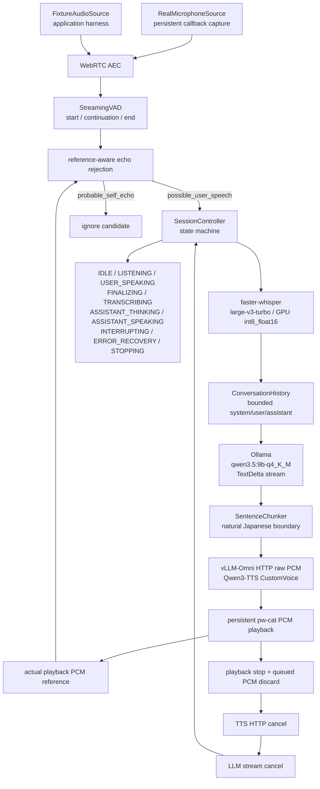

# アーキテクチャ

local-live-jaは、固定済みのモデルと音声部品を`SessionController`へ統合した連続会話PoCです。`bench app`も同じcontrollerと`LivePipeline`を使い、入力sourceと出力sinkだけを注入します。

## 全体図

## runtime責務

### Persistent captureとVAD

`RealMicrophoneSource`は固定8秒録音を行わず、callbackから短いPCM blockをqueueします。`StreamingVAD`はnoise floor、minimum speech duration、end silence/hangover、max utterance durationを持ち、speech endでutteranceを確定します。短すぎる発話はASRへ送られません。

### AECとecho rejection

assistant playback中もcaptureは継続します。AEC後のcandidateを既存のreference-aware echo rejectionへ渡し、assistant referenceで説明できるものを`probable_self_echo`として無視し、残差を`possible_user_speech`としてbarge-in候補にします。playback中にVADを単純無効化する実装ではありません。

### LLMからTTS

`LivePipeline.respond()`のchat経路は、LLM streamを完了までjoinしません。各`TextDelta`を`SentenceChunker`へfeedし、自然な句読点・phrase境界が完成すると同じTTS backendとplayback componentをただちに呼びます。`tool_registry`を使う既存diagnostic経路はtool callの整合性を優先します。

### 履歴と発話済みtext

`ConversationHistory`はsystem messageを保持し、userをASR確定時に追加します。assistant messageへ追加するのはTTS/playbackが完了した`spoken_text`だけです。LLMが生成しただけの`generated_text`やcancelで未再生のsuffixは履歴に入りません。turn数と文字数の上限でtrimします。

### cancelとbarge-in

barge-in時は、controllerが一つの既存cancel経路を呼びます。順序はplayback停止・queued PCM破棄、TTS HTTP cancel、LLM stream cancel、実際に再生済みの`spoken_text`だけを確定、次user utteranceの処理です。新しいcancel subsystemは作っていません。

### dependency injection

productionは`RealMicrophoneSource`、`PipeWirePCMPlayback`、実ASR/LLM/TTSを使います。application harnessは`FixtureAudioSource`、in-memory playback、scripted ASR/LLM/TTSを注入します。抽象層はSessionControllerの自動検証に必要な範囲に限定しています。

## lifecycle

`chat`の終了、SIGINT、SIGTERM、fatal errorでは、controller、playback、capture、AEC、ASR/TTSをboundedに停止します。owned vLLM serverを起動する運用ではserver ownerが終了時に停止し、外部で起動したserverは停止しません。audio settingsは既存のsnapshot/restore処理を使います。
